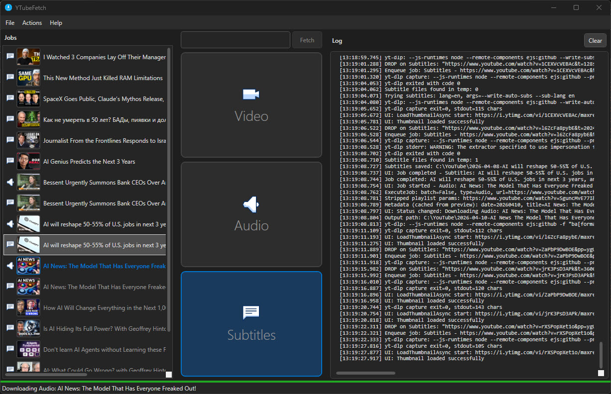
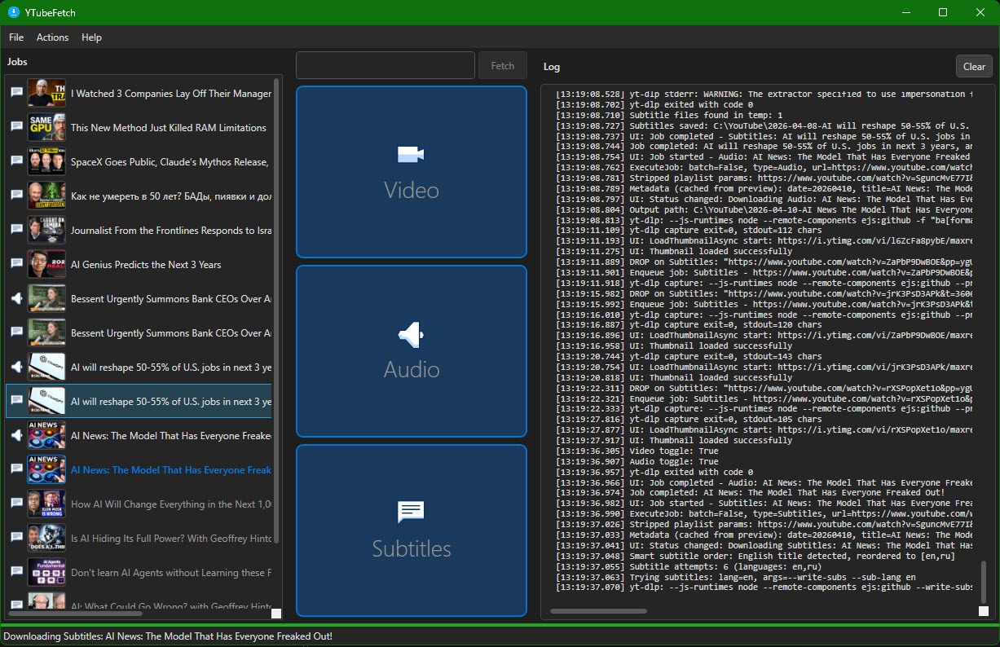
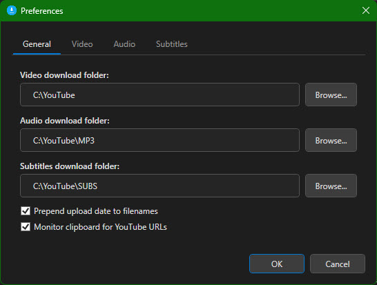

# YTubeFetch

Windows desktop application for downloading YouTube videos, audio, and subtitles.

## Why This Exists

The ability to download subtitles from any YouTube video, playlist, or entire channel for subsequent use with AI tools is more important than ever. Clean plain-text transcripts extracted from long-form podcasts, interviews, and lectures are the raw material for AI summarization, research, and analysis. At the time this app was designed (early April 2026), no free desktop application existed that could batch-download subtitles from playlists and channels with a simple UI, strip timestamps, deduplicate lines, and produce AI-ready text output.

So I designed it for my own use and decided to share it with the world.

The app was designed by the author and coded by Claude. It was tested with the lightweight WPF MCP server located in the [wpf-mcp](https://github.com/vkorost/wpf-mcp) project.

## Requirements

- Windows 10 or Windows 11
- [.NET 8 Desktop Runtime](https://dotnet.microsoft.com/download/dotnet/8.0)
- [yt-dlp](https://github.com/yt-dlp/yt-dlp) (auto-discovered from PATH or common install locations)
- [ffmpeg](https://ffmpeg.org/) (auto-discovered from PATH or common install locations)

On first run, YTubeFetch will locate yt-dlp and ffmpeg from your system and copy them to `%LOCALAPPDATA%\YTubeFetch\bin\` for future use. You can update yt-dlp later from the Actions menu.

## Download

Download [`YTubeFetch-v1.0.0-win-x64.zip`](dist/YTubeFetch-v1.0.0-win-x64.zip) from the `dist/` folder, extract it, and run `YTubeFetch.exe` from the extracted `YTubeFetch/` folder.

## How It Works

The interface is built around three ideas: a job list, three toggle panels, and a log.



The left panel is the job list. It shows every video that has been queued or downloaded, with a thumbnail and title. Right-clicking a job lets you open the file, open its folder, retry it, or remove it from the list.

The center of the window has three large panels: Video, Audio, and Subtitles. Click a panel to toggle that download type on or off. Active panels are highlighted in blue. When you paste or type a YouTube URL and press Fetch, the app downloads whichever types are currently active. The panels also serve as drag-and-drop targets: dropping a URL onto a specific panel activates that type in addition to whatever is already on, then starts the download.



The right panel is a live log that shows yt-dlp output, metadata, and any errors in real time.

Clipboard monitoring is on by default. Copy a YouTube URL anywhere and the app detects it, places it in the URL bar, and shows a notification if the window is minimized to the system tray.

Playlists and channels are supported. For large playlists (over 50 items), the app prompts you to choose a batch size. Videos in a batch are downloaded sequentially with a 10-second pause between items to avoid rate limiting.



Preferences let you set separate download folders for each content type, choose video quality and audio format, configure subtitle language priority, and toggle features like date-prefixed filenames and clipboard monitoring.

For a full walkthrough of every feature, open Help > User Guide from the menu bar inside the app.

## Features

- Download YouTube videos, audio, and subtitles via yt-dlp
- Drag-and-drop or paste YouTube URLs
- Clipboard monitoring with system tray notifications
- Configurable video quality (Best / 1080p / 720p / 480p / 360p)
- Multiple audio formats (MP3, AAC, OGG, OPUS, WAV) with quality selection
- Subtitle download with language priority, fallback, and smart language detection
- Playlist and channel support with batch size control
- Video thumbnail previews in the job list
- Dark and light theme support (follows Windows system setting)
- Separate download folders for video, audio, and subtitles
- Job queue with retry and right-click context menu
- Original audio preference (skips AI-dubbed tracks)
- Rate limit handling with escalating retry (10s / 30s / 60s)

## Build

```bash
# Build
dotnet build

# Run
dotnet run --project src/YTubeFetch/YTubeFetch.csproj

# Publish single-file exe
dotnet publish src/YTubeFetch/YTubeFetch.csproj -c Release -r win-x64 --self-contained false -p:PublishSingleFile=true
```

## License

This project is licensed under the MIT License. See [LICENSE](LICENSE) for details.
